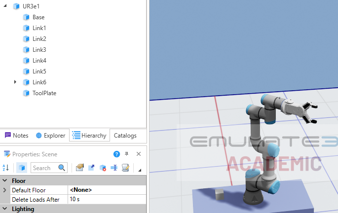
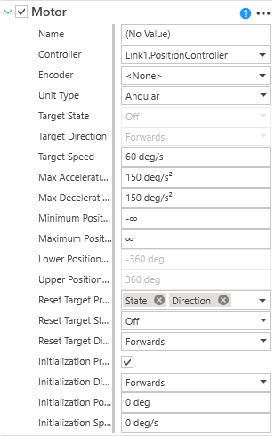
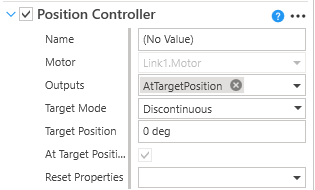
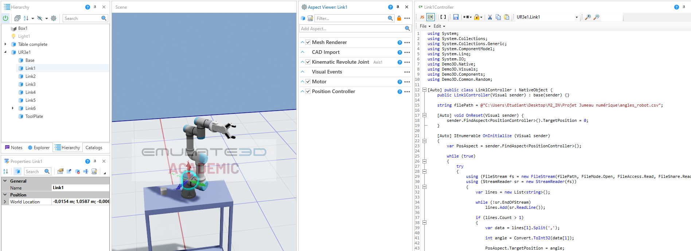
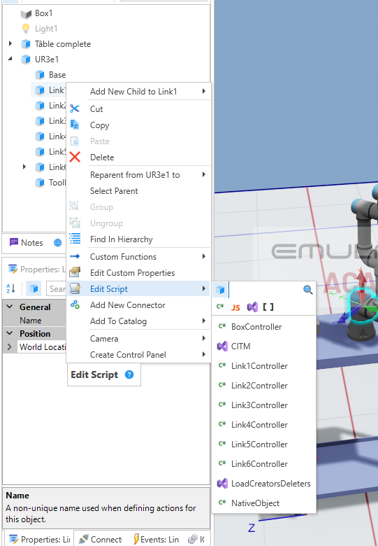
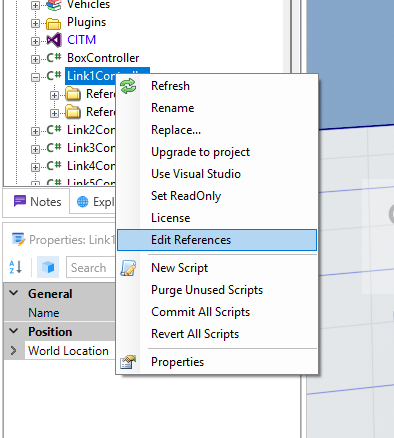
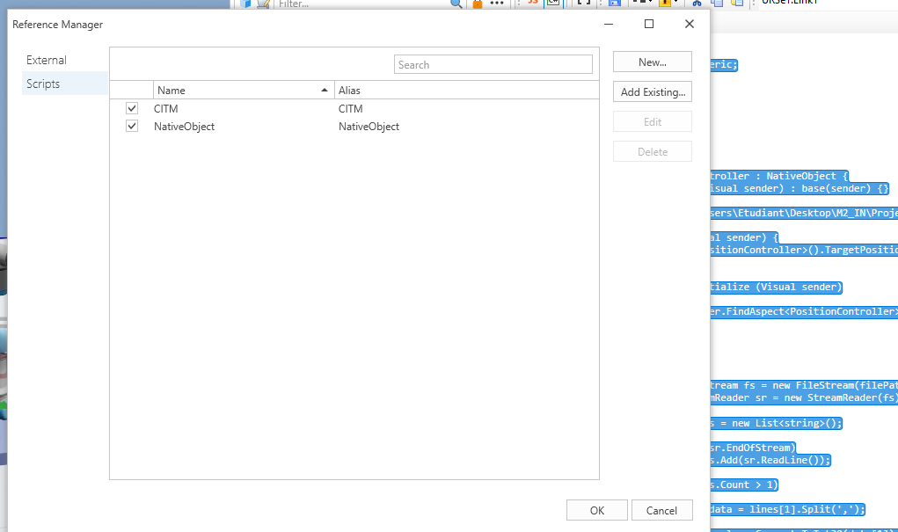

# Tutoriel Emulate3D – Intégration UR3e (Catalogue → Axes → Scripts C# → CSV)

## Objectif

Mettre en place un jumeau numérique d’un robot UR3e dans Emulate3D avec :
- Import du robot depuis le catalogue
- Ajout des moteurs et des PositionControllers
- Pilotage des axes via scripts C#
- Lecture des angles depuis un fichier CSV

---

## 1. Import du robot depuis le catalogue

### Étapes

1. Ouvrir Emulate3D  
2. Aller dans :  
   `Tools → Catalog`  
3. Rechercher :  
   `UR3e`  
4. Glisser-déposer le robot dans la scène  

### Résultat attendu

Le robot apparaît dans le Model Browser avec ses différents links.

---

## 2. Vérification de la hiérarchie

Vérifier une structure de ce type :

Chaque link correspond à un axe du robot.

---

## 3. Ajout des moteurs (Motor)

### Principe

Chaque axe est piloté par un moteur en rotation.

### Étapes (à répéter pour chaque Link)

1. Sélectionner un Link  
2. Ajouter :  
   `CAD Is The Model → Motors → Motor`  
3. Configurer :
   - Type : Rotational  
   - Axe de rotation : selon le joint  
   - Parent / Child correctement définis  

### Résultat attendu

Chaque axe devient mobile.

---

## 4. Ajout des PositionControllers

### Principe

Le PositionController permet de piloter l’angle d’un axe.

### Étapes

Pour chaque Link :

`CAD Is The Model → Motor Controller → Position Controller`

### Résultat attendu

Chaque axe peut être piloté via la propriété :

`TargetPosition`

---

## 5. Architecture d’un axe

Pour chaque axe :

---

## 6. Script C# par axe (Exemple pour l'axe1 ->Link1Controller pour l'axe2->Link2Controller)
Dans un premier temps ajouter un script (Restait sur Script et non Aspect)en faisant clique droit sur l'axe que vous voulez faire dans la hierarchie et cliquer Edit Script.

ensuite copier coller ce script en c# et modifier les noms adéquat aux noms dans votre hiérarchie et fichier csv.
- [Script Axe 1](./code/Link1Controller.cs)
Maintenant il faut que vous avez le script citm dans explorer. (pour cela vous avez besoin de soit le trouver sur le site ou récupérer le fichier emulate sur le git et utiliser celui déjà importer)

on va maintenant référencer chacun des script aux citm 

Dans la fenêtre qui s'est ouvert, sélectionner add existing et sélectionner citm

### Principe

- Un script par axe

## 7. Lien avec le script Python et gestion de l’offset

À partir de cette étape, le fonctionnement du robot dans Emulate3D dépend directement du script Python.
Le script Python :
- récupère les angles du robot réel via RTDE  
- applique un offset si nécessaire  
- écrit les valeurs dans un fichier CSV  

Les scripts C# dans Emulate3D lisent ensuite ce fichier pour piloter chaque axe.

### Accès au script Python

- [Script Python (RTDE → CSV)](./code/ur3e_rtde_reader_Csv.py)

---

## 8. Réglage 

Pour fluidifier la visualisation du robot , 
il est possible de jouer avec le rafraichissement via les temporisations dans le code python ainsi que dans les scripts C#.

La mise en place d'offset est aussi nécessaire dans le cadre de certains robot 
où leur positions réel ne soit pas les mêmes que les positions du fichier 3D.

Pour simplifier la démarche mettait le robot à sa position initial et regardé la différence entre le réel et la simulation et a juster les offsset du code python. 

---
